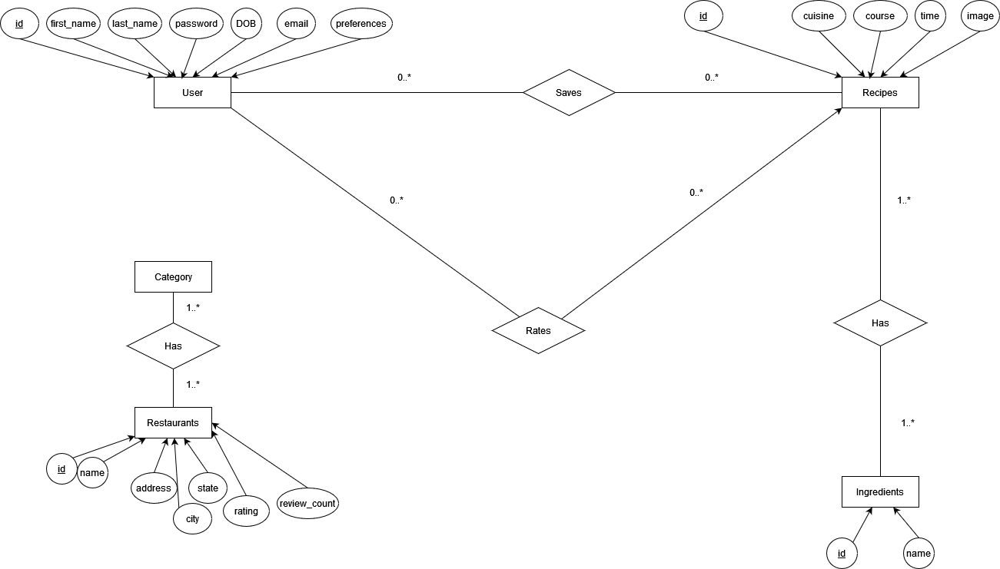

# Recipe and Restaurants Recommender

## Description
A recipe and restaurants recommender using datasets from Yummyly and Yelp. The main idea behind this project was to recommend recipes based on the user's favorite restaurants and to recommend restaurants based on the user's favorite recipes.

## Features
* Users can create an account and signup with their information
* Users can log into their accounts and log out of their accounts
* Users can use the recipe recommender to get recipe recommendations based on:
  * Their favorite restaurant's cuisine type
  * Their minimum recipe rating score
  * Their maximum preperation time
* Users can also click on preset recipe reommendations that will recommend:
  * All the highest rated recipes
  * All the lowest rated recipes
  * All recipes above average
  * The best recipes for each cuisine type
* Users can use the restaurant recommender to get restaurant recommendations based on:
  * Their favorite recipe's cuisine type
  * Their minimum restaurant rating score
  * Their minimum restaurant review count
  * Their restaurant state of origin
* Users can also click on preset restaurant reommendations that will recommend:
  * The best restaurant for each city
  * The best resaurant for each state
  * The best restaurant for each city and the best matching recipe for that restaurant
* Users can save recipes that they enjoy and view them in a different tab
* Users can rate recipes and these user ratings will show on the recipes page

## Project Folder Structure
```
├── client
│   ├── public
│   ├── src
|   |   ├── components
|   |   |   ├── home
|   |   |   ├── recipe
|   |   |   ├── restaurant
|   |   |   ├── search
|   |   ├── pages
|   |   ├── App.js
│   ├── package.json
├── server
|   ├── config.json
│   ├── package.json
│   ├── routes.js
│   ├── server.js
└── README.md
```

## How to Run the Project
```
git clone the-repository
in two terminals:
cd client
npm install
npm start
cd server
npm install
npm start
```

## Database Design

### Datasets


### ER Diagram


### Schemas
* Recipes(recipe_id, totalTime, name, rating)
  * Main table for recipe information (422 rows)
* Ingredients(recipe_id, ingredient)
  * Table for every ingredient in each recipe (4,069 rows)
* Images(recipe_id, images)
  * Table for the image corresponding to the recipe (423 rows)
* Cuisines(recipe_id, cuisine)
  * Table for every cuisine type for each recipe (554 rows)
* Restaurants(restaurant_id, name, address, city, state, rating, review_count)
  * Main table for restaurant information (43,981 rows)
* Restaurant_Categories(restaurant_id, category)
  * Table for each category a restaurant falls under (208,289 rows)
* User(id, first_name, last_name, password, DOB, email, preferences)
  * Main table for user information
* User_Recipes(user_id, recipe_id)
  * Table listing each recipe a user has saved
* Recipe_Ratings(user_id, recipe_id, rating)
  * Table listing the rating users give a specific recipe

## Technologies
- React
- React Bootstrap
- Node.js
- Express.js
- MySQL
- Axios
- React Router

## Credit
| Name      | GitHub Username |
| ----------- | ----------- |
| Raymon Shi      | [raymon-shi](https://github.com/raymon-shi)       |
| Harrison Ly   | [hly8](https://github.com/hly8)        |
| Rohan Rashid   | [kevinliang8](https://github.com/kevinliang8)        |
| Kevin Liang   | [rorashid23](https://github.com/rorashid23)        |
